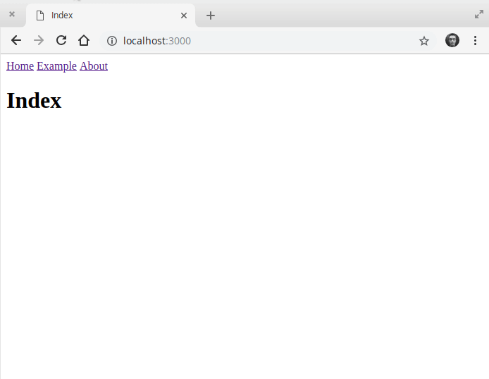

# ⚡ Guess.js

Guess.js 可以预测性地预取 Nuxt.js应用程序中的页面
> 以下内容为示例，可以根据自己的需求来调整自己的项目

## 使用

yarn 和 npm 安装:

```js
yarn add guess-webpack
OR
npm i -D guess-webpack
```

在 `layouts` 目录中 `default.vue` 文件，修改如下:

```js
<template>
  <div>
    <nav>
      <nuxt-link to="/" exact>Home</nuxt-link>
      <nuxt-link to="/example">Example</nuxt-link>
      <nuxt-link to="/about">About</nuxt-link>
    </nav>
    <nuxt/>
  </div>
</template>
```

在 `page` 目录中创建对应的 `*.vue` 文件作为程序的路径

```
-| pages/
----| example.vue
----| about.vue
----| media.vue
----| index.vue
```

在 `pages/about.vue` 中添加一个 `media` 页面链接:

```js
<template>
  <div>
    <h1>About</h1>
    <p>You can find the media page <nuxt-link to="/media">here</nuxt-link>.</p>
  </div>
</template>
```

在其他 `pages/*.vue` 添加一些内容

```js
<template>
  <h1>[REPLACE_WITH_TITLE_PAGE]</h1>
</template>
```

运行 `npm run dev` 并打开 `http://localhost:3000`，您的应用程序应如下所示：



## 配置Nuxt.js

将 `GuessPlugin` 插件在 `nuxt.config.js` 导入并配置在 `webpack` 中，内容如下:

```js
import { readFileSync } from 'fs'
import { GuessPlugin } from 'guess-webpack'

export default {
  build: {
    extend(config, ctx) {
      if (ctx.isClient) {
        config.plugins.push(
          new GuessPlugin({
            reportProvider() {
              return Promise.resolve(JSON.parse(readFileSync('./routes.json')))
            }
          })
        )
      }
    }
  }
}
```

在根目录创建一个 `routes.json` 文件，和 `nuxt.config.js` 为同一级目录，并添加以下内容：

```js
{
  "/": {
    "/example": 80,
    "/about": 20
  },
  "/example": {
    "/": 20,
    "/media": 0,
    "/about": 80
  },
  "/about": {
    "/": 20,
    "/media": 80
  },
  "/media": {
    "/": 33,
    "/about": 33,
    "/example": 34
  }
}
```

此文件指定用户从另一个页面访问给定页面的次数。举例来说，如果我们进入 `/` 路由时，有80个用户在访问，
那么将在该路由页面加载完成时，去预渲染 `/about` 路由的所有东西，再进入 `/about` 时页面就会秒出来，因为在 `/` 路由时就已经把 `/about` 全部给预渲染出来了。

> 或者，如果您使用的是Google Analytics（分析），而不是提供 `reportProvider`，则可以GA使用Google Analytics View ID 设置该属性。在这种情况下，Guess.js将从您的Google Analytics帐户中获取数据并自动生成报告。为此，您必须提供对视图的只读访问权限。

在这种特殊情况下，有一些细微的变化 `nuxt.config.js`:

```js
import { readFileSync } from 'fs'
import { GuessPlugin } from 'guess-webpack'

const { GA } = process.env

export default {
  build: {
    extend(config, ctx) {
      if (ctx.isClient) {
        let guessOptions = {}
        if (GA) guessOptions.GA = GA
        else guessOptions.reportProvider = () => Promise.resolve(JSON.parse(readFileSync('./routes.json')))

        config.plugins.push(
          new GuessPlugin(guessOptions)
        )
      }
    }
  }
}
```

替代方案，Guess.js 还提供了 [@nuxtjs/guess](https://github.com/daliborgogic/guess-module) 模块！

## Google Analytics（分析）

- @nuxtjs/guess 为项目添加依赖项
- 添加 `@nuxtjs/guess` 到 `nuxt.config.js` 中 `modules`

```js
{
  "modules": [
    [ "@nuxtjs/guess", { "GA": "XXXXXXX" }]
 ]
}
```

无需做任何事情，`@nuxtjs/guess` 将根据您的Google Analytics统计数据自动预取路由😎

在 `plugin` 目录下添加 `guess.js`:

```js
import Vue from 'vue'
import { guess } from 'guess-webpack/api'

export default ({ app: { router } }) =>  {
  router.afterEach(to => {
    // Wait for page to be displayed
    Vue.nextTick(() => {
      let predictions = Object.keys(guess()).sort((a, b) => a.probability - b.probability)
      predictions.forEach(path => {
        router.getMatchedComponents(path).forEach(Component => {
          if (typeof Component === 'function') {
            try { Component() } catch (e) {}
          }
        })
      })
    })
  })
}
```

在 `nuxt.config.js` 中注册该插件:

```js
export default {
  plugins: [
    { src: '~/plugins/guess', ssr: false }
  ]
}
```

## 链接

[guess-js](https://guess-js.github.io/docs/nuxt)
